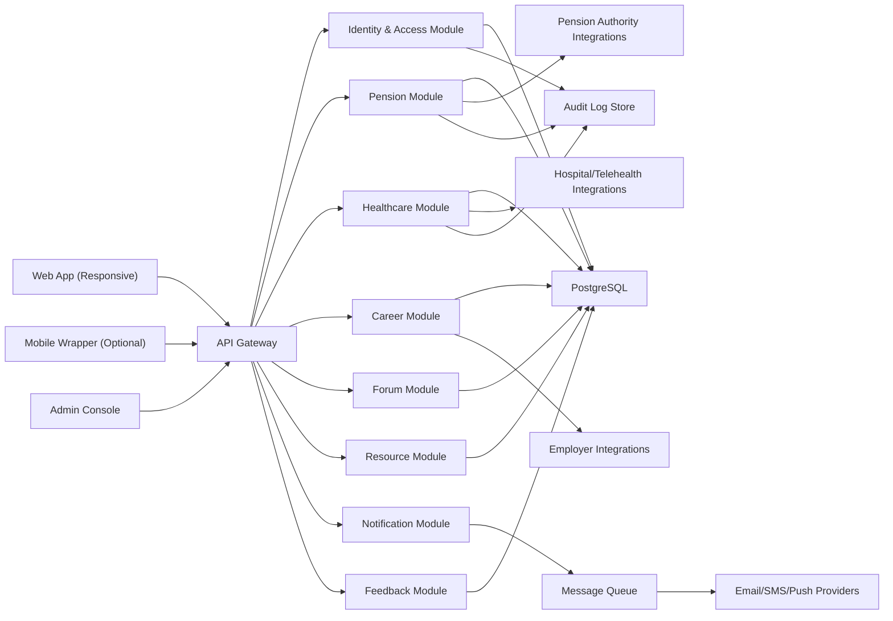

# Retired Defence Officers Digital Platform Design

## 1) Vision and Scope

Build a single digital platform that helps retired defence officers manage:

- personal account and identity
- pension lifecycle
- healthcare access and claims
- civilian re-employment and skill growth
- trusted peer community and expert access
- notifications and alerts
- curated retirement resources
- service feedback and issue reporting

Primary design goals:

- simple, low-friction experience for senior users
- secure by default for sensitive personal and financial data
- auditable operations for pension and healthcare workflows
- accessible interface for users with visual, hearing, or motor limitations

## 2) User Roles and Permissions

### Core Roles

- Retired Officer (primary user)
- Family Nominee/Caregiver (delegated with consent)
- Pension Case Officer (government/admin processing team)
- Healthcare Coordinator (benefits and provider support)
- Employer Partner (job posting and hiring workflows)
- Community Moderator (forum safety and policy enforcement)
- Super Admin (platform operations and compliance)

### Permission Model

- RBAC for baseline access (role menus and API permissions)
- ABAC for sensitive records (pension/health data filtered by user and consent)
- Delegation grants for caregivers with strict scope and expiry
- Full audit trail for every read/write on pension, claims, and profile updates

## 3) Information Architecture (Navigation)

Top-level navigation for end users:

1. Home
2. Pension
3. Healthcare
4. Career
5. Community
6. Resources
7. Notifications
8. Help & Feedback
9. Profile & Security

Home dashboard cards:

- Pension summary (last payment, next expected date, active requests)
- Upcoming appointments (clinic and telehealth)
- Recommended jobs/workshops
- Community updates (followed topics)
- Alerts requiring attention (documents, approval, pending claims)

## 4) Feature Design

## 4.1 User Account Management

### Functional Requirements

- Signup via mobile/email with OTP verification
- Secure login with password + optional 2FA
- Supported 2FA methods:
- Authenticator app (TOTP)
- SMS OTP fallback (optional by policy)
- Password reset by verified channel + risk checks
- Profile management:
- personal details
- service history metadata
- emergency contacts
- nominee/caregiver access consent
- session/device management:
- active sessions list
- revoke session/device
- suspicious login alerts

### Security Controls

- Passwords hashed with Argon2id
- Adaptive rate limiting, CAPTCHA on abnormal attempts
- Account lockout and cooldown policy
- Login risk scoring (new device, impossible travel, repeated failures)

## 4.2 Pension Management

### Pension Dashboard

- Current pension amount and disbursal channel
- Last 12 months payment history with downloadable statements (PDF/CSV)
- Upcoming payment estimate/date
- Tax and deduction view
- Pension-related announcements and policy circulars

### Pension Requests Workflow

Users can raise requests for:

- bank account updates
- address/contact changes
- nominee corrections
- life certificate issues
- discrepancy/arrears queries

Workflow states:

1. Draft
2. Submitted
3. Under Review
4. Clarification Required
5. Approved/Rejected
6. Completed

Each request includes:

- required document checklist
- SLA clock
- assigned officer details
- status timeline with timestamps
- in-app message thread

## 4.3 Healthcare Services

### Provider Directory

- Search hospitals, clinics, labs, specialists
- Filters: location, specialty, empanelment, teleconsult availability
- Facility profile: address, timings, accepted benefits, ratings

### Appointment and Telehealth

- Book, reschedule, cancel appointments
- Slot availability and reminders
- Video consultation with secure waiting room
- Prescription and consultation notes access after visit

### Benefits and Claims

- Coverage summary by category
- pre-authorization flow (if needed)
- claim submission with document upload
- claim status tracking and settlement history
- rejection reason and re-submission guidance

## 4.4 Career Development and Re-employment

### Job Board

- Civilian roles mapped to defence skills
- Filters: location, sector, role type, compensation band, remote/hybrid
- Verified employers and anti-fraud listing checks

### Resume and Application

- Resume builder with service-to-civilian skill translator
- Resume templates by role
- One-click apply to eligible listings
- Application tracker:
- Applied
- Under Review
- Shortlisted
- Interview
- Offer
- Closed

### Learning and Transition

- Interview preparation kits
- Workshops and webinars calendar
- Skill tracks (operations, security, logistics, leadership, IT basics)
- Completion badges and downloadable certificates

## 4.5 Community Forum

### Community Capabilities

- Topic channels: pension, health, legal, career, wellbeing, local groups
- Thread posting, replies, tagging, bookmarking, reporting abuse
- Anonymous mode option for sensitive questions
- Expert AMAs and scheduled Q&A sessions

### Moderation

- Code of conduct and guided onboarding
- Auto-flagging (toxicity/spam/PII leakage)
- Moderator queue with escalation controls
- Suspension and appeal workflow

## 4.6 Notifications and Alerts

Channels:

- in-app
- email
- SMS (optional)
- push notifications (if mobile wrapper exists)

Notification categories:

- pension status/payment alerts
- healthcare reminders and claim updates
- job matches/interview reminders
- workshop/community events
- account security alerts

User controls:

- category-level opt in/out
- quiet hours
- channel preference by event type

## 4.7 Resource Center

Content types:

- articles
- quick guides
- checklists
- videos
- downloadable forms

Taxonomy:

- financial planning
- health management
- legal and documentation
- career transition
- digital literacy

Capabilities:

- multilingual publishing
- read/listen modes
- save for later
- recommendation engine based on profile and usage

## 4.8 Feedback Mechanism

- One-click feedback from any page
- Issue reporting with screenshot/file attachments
- Feature suggestion board with voting
- Ticket tracking for submitted feedback
- CSAT and NPS micro-surveys after key workflows

## 4.9 Accessibility Features

- WCAG 2.2 AA baseline
- Text-to-speech for key pages and articles
- Adjustable font size and line spacing
- High contrast themes and color-safe palette
- Keyboard-only navigation support
- Screen reader optimized labels, landmarks, and forms
- Motion reduction and simplified layout mode
- Language toggle and plain-language content mode

## 4.10 Data Security and Privacy

### Technical Controls

- TLS 1.3 in transit; AES-256 at rest
- Token-based auth (short-lived access + refresh rotation)
- Field-level encryption for sensitive identifiers
- Centralized secrets management and key rotation
- WAF, DDoS protection, API gateway throttling
- Immutable audit logs and SIEM integration

### Privacy and Governance Controls

- Privacy-by-design in feature lifecycle
- Granular consent management (caregiver access, communications)
- Data minimization and purpose limitation
- Configurable retention policies per data class
- Data subject rights workflow (access/correction/deletion as applicable law permits)
- Breach response runbook with notification SLA

### Compliance Alignment (to be validated by legal counsel)

- Country-specific data protection law
- Applicable defence/government data handling directives
- Healthcare privacy requirements for medical records and teleconsult logs

## 5) UX Design Principles

- Senior-first UI: larger tap targets, clear typography, reduced cognitive load
- Progressive disclosure: show essentials first, advanced details on demand
- Consistent layout and labels across modules
- Form assist: inline validation, tooltips, document examples
- Human support fallback: visible help center and assisted support route

## 6) Suggested Technical Architecture

## 6.1 Deployment Pattern

Recommended approach: modular monolith first, then extract services when scale requires.

Modules:

- Identity and Access
- Pension Management
- Healthcare and Claims
- Career and Learning
- Community and Moderation
- Notifications
- Content/Resource Center
- Feedback and Analytics

## 6.2 High-Level System Diagram

## 6.3 Suggested Stack

- Frontend: React + TypeScript, accessible component library, SSR for performance
- Backend: Node.js (NestJS) or Java (Spring Boot), REST + event-driven notifications
- Database: PostgreSQL (primary), Redis (cache/session/rate limit)
- Search: OpenSearch/Elasticsearch for resources, jobs, forum
- File Storage: S3-compatible object storage with malware scanning
- Messaging: RabbitMQ/Kafka for async jobs and notifications
- Observability: OpenTelemetry + Prometheus + Grafana + centralized logging

## 7) Core Data Model (Logical)

Key entities:

- User, Credential, Session, Device
- Profile, ServiceHistory, Nominee, ConsentGrant
- PensionAccount, PensionPayment, PensionRequest, PensionDocument
- HealthcareProvider, Appointment, TelehealthSession, Claim, ClaimDocument
- JobPosting, Resume, Application, InterviewEvent, LearningSession
- ForumCategory, Post, Reply, ModerationAction
- ResourceItem, ResourceTag, UserBookmark
- NotificationPreference, NotificationEvent
- FeedbackTicket, SurveyResponse
- AuditEvent

## 8) API Surface (Illustrative)

Authentication and profile:

- `POST /auth/register`
- `POST /auth/login`
- `POST /auth/2fa/verify`
- `POST /auth/password/forgot`
- `PUT /users/me`
- `POST /users/me/delegates`

Pension:

- `GET /pension/summary`
- `GET /pension/payments?from=&to=`
- `POST /pension/requests`
- `GET /pension/requests/{id}`
- `POST /pension/requests/{id}/messages`

Healthcare:

- `GET /healthcare/providers`
- `POST /healthcare/appointments`
- `POST /healthcare/telehealth/sessions`
- `POST /healthcare/claims`
- `GET /healthcare/claims/{id}`

Career:

- `GET /career/jobs`
- `POST /career/resumes`
- `POST /career/applications`
- `GET /career/workshops`

Community:

- `GET /forum/categories`
- `POST /forum/posts`
- `POST /forum/posts/{id}/replies`
- `POST /forum/posts/{id}/report`

Notifications and feedback:

- `GET /notifications`
- `PUT /notifications/preferences`
- `POST /feedback/tickets`

## 9) Workflow Designs

## 9.1 Pension Update Request

1. User selects request type.
2. System shows required documents.
3. User submits form + uploads files.
4. Validation and fraud checks run.
5. Case assigned to officer.
6. Officer requests clarification if needed.
7. User responds in thread.
8. Officer approves/rejects.
9. User receives final notification and downloadable closure note.

## 9.2 Claim Submission

1. User opens claim wizard.
2. Benefit eligibility pre-check runs.
3. User uploads bills/reports.
4. OCR + manual verification queue.
5. Claim decision generated.
6. Settlement update posted to dashboard.

## 10) UI Blueprint (Key Screens)

Screen list:

- Onboarding and secure login
- Home dashboard
- Pension details and requests
- Healthcare directory and booking
- Telehealth session room
- Claims center
- Career hub (jobs, resume, applications)
- Community forum and AMA events
- Resource library
- Notifications center
- Help and feedback
- Profile, accessibility, privacy controls

Design tokens (example baseline):

- Font scale: base 18px, large readability mode up to 22px
- Minimum touch target: 44x44 px
- Contrast ratio: minimum 4.5:1 normal text, 3:1 large text
- Icon + text labels on all critical actions

## 11) Non-Functional Requirements

- Availability: 99.9% monthly uptime target
- Performance: P95 page load under 2.5s on standard 4G/mobile
- Scalability: horizontal API scaling and queued background jobs
- Reliability: idempotent critical APIs and retry-safe workflows
- Auditability: immutable logs for privileged and sensitive events
- Localization: multilingual content and date/number localization

## 12) Analytics and Success Metrics

Adoption and engagement:

- Monthly active retired officers
- Weekly login frequency
- Completion rate for pension and claim workflows

Service quality:

- Pension request turnaround time
- Claim settlement cycle time
- Appointment no-show rate

Career impact:

- Job application completion rate
- Interview conversion rate
- Hiring rate through platform

Trust and quality:

- CSAT/NPS
- Community moderation resolution time
- Security incident count and response time

## 13) Delivery Roadmap

Phase 1 (MVP, 12-16 weeks):

- Identity, profile, 2FA
- Pension dashboard + request tracking
- Basic healthcare directory + appointment booking
- Notifications center
- Foundational accessibility and audit logging

Phase 2 (8-12 weeks):

- Claims workflow + telehealth
- Career hub (jobs, resume, apply)
- Resource center with multilingual support
- Feedback portal and analytics dashboards

Phase 3 (8-12 weeks):

- Community forum + expert AMA
- Advanced personalization and recommendations
- Expanded integrations and operational automation

## 14) Testing and Assurance

- Unit tests for domain logic and validations
- API contract tests for all external integrations
- End-to-end tests for pension, claims, and job application flows
- Security testing: SAST, DAST, dependency scanning, periodic pen tests
- Accessibility testing: automated + manual screen-reader audits
- UAT with retired officers across age and digital skill bands

## 15) Risks and Mitigations

- Low digital literacy
- Mitigation: guided flows, assisted support, tutorial mode, multilingual UI

- Data sensitivity and trust risk
- Mitigation: strong security posture, transparent audit and consent controls

- Integration delays with external authorities/providers
- Mitigation: API adapters, sandbox contracts, staged rollout by integration readiness

- Forum misuse or misinformation
- Mitigation: moderation tooling, expert verification badges, reporting SLA

## 16) Immediate Next Build Outputs

1. Clickable wireframes for 12 key screens.
2. OpenAPI specification for MVP endpoints.
3. Database schema draft for core pension/health/job entities.
4. Security architecture review and threat model.
5. Sprint backlog with user stories and acceptance criteria.
